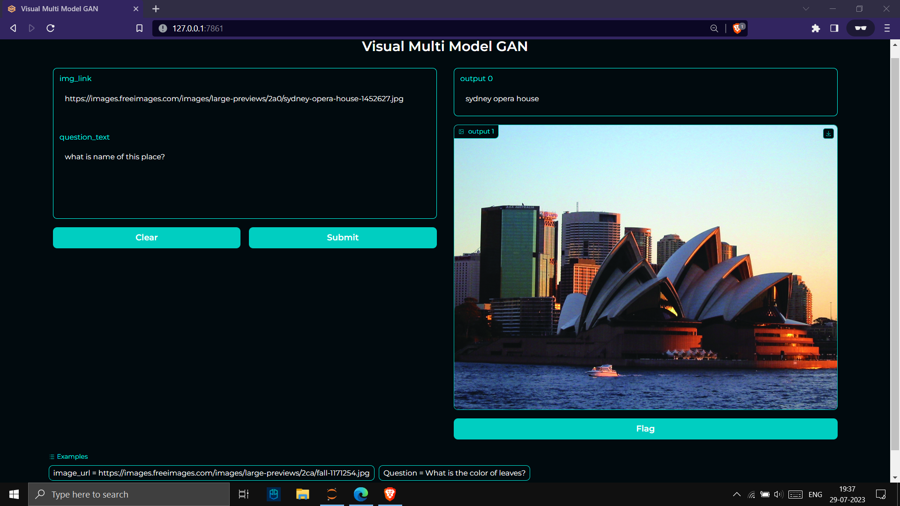
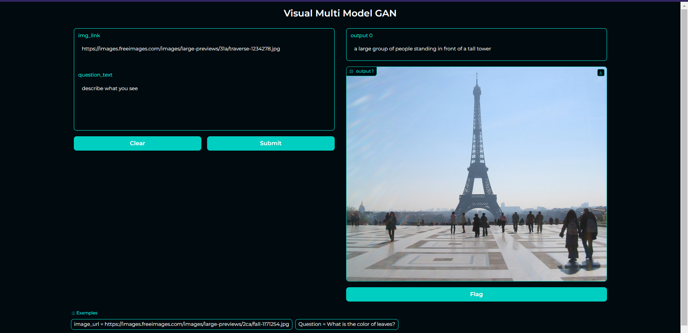
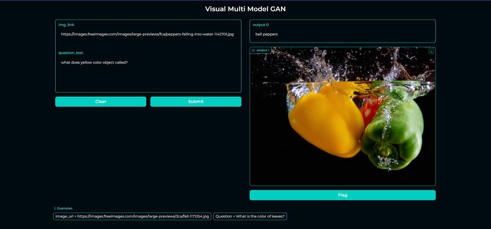

# Multi-Model-Visual-GAN

This is a Web interface working Deep Neural Network using GAN architecture where you will be entering absolute url of any image on internet and based on that image you can perform several Q/A s & and DNN model will try to segment and analyse whole image by dividing into small individuals based on classfications of objects then ultimately give you answers based which aligns best with repect to question and image.

<h2>Requirements</h2>
<ul>
<li>Python 3.10 or above</li>
<li>Jupyter notebook</li>
<li>Transformers >= 4.25 library</li>
<li>Torch<li>
<li>Gradio</li>
<li>Lavis library (pip install salesforce-lavis)</li>
<li>16GB RAM (Minimum Req) or 16GB VRAM (if using CUDA)<li>
</ul>

<h2>How to run this project</h2>

Download VGAN_AI.ipynb then install required packages , then run all the cells and it will download pytorch model (~5GB Approx) (C:\Users\{username}\.cache\torch\hub\checkpoints) after all cells ran successfully you will get WEBUI IP:PORT , just click on it to access the project.

<h2>Outputs</h2>

<h1 align="center">THE END ! 💾📂</h1>
